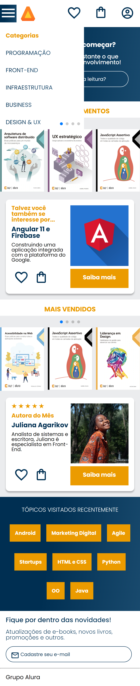

## Alura Book em HTML / CSS:

Bem-vindo! 

Essa é um projeto que realizei no curso da Alura (maior comunidade de tecnologia do país).

No projeto Alura Book mobile, desenvolvi um header com menu hamburger funcional, um banner com imagem de fundo no input de pesquisa, 
importei um plugin para criar um carrossel, criei um card utilizando flexbox, uma seção de mais vendidos, uma seção de tópicos visitados recentemente, 
uma seção de contatos e um footer. Aprendi a utilizar media queries para tornar o layout responsivo em tablets, implementei um menu específico para tablets,
criei um footer com todos os produtos da Casa do Código e desenvolvi a versão desktop do projeto. Além disso, você aprendi sobre a aplicação de bordas em elementos 
específicos. 

## Layout desenvolvido pela Alura e disponibilizada no Figma. 

## Conheça o aplicativo clicando no link
https://polysaantana.github.io/alura-metodologia-mobile-first/

  
  
  
 

### Ferramentas utilizadas: 

* Figma
* Vscode

### Tecnologias:

* HTML

* CSS

### Autora:
<table>
  <tbody>
    <tr>
	    <td align="center" valign="top">  <a href="https://github.com/polysaantana"> 
            
Polyanna
 </a>
      </td>
      </td>
    </tr>
  </tbody>
</table>
